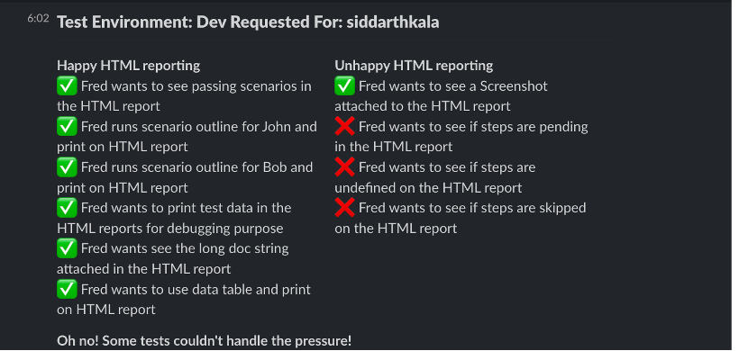

# Cucumber Reporter

`cucumber-reporter` is an npm library designed to merge multiple Cucumber JSON reports and optionally post the results to a Slack channel. It helps streamline the process of aggregating Cucumber test results and sharing them in a team communication platform like Slack.

## Features

- Merge multiple Cucumber JSON reports into a single report.
- Recursively search for reports in subdirectories.
- Generate a merged report in a specified output file.
- Optionally post the merged report to a Slack channel using a Slack webhook.

## Installation

To install the `cucumber-reporter` package, run the following command:

`npm install cucumber-reporter --save-dev`

## Usage

### Merging Cucumber Reports

You can merge multiple Cucumber JSON reports into a single file using the following command:

`node bin/cucumber-reporter.js merge --recursive --dir reports -o bin/merged-report.json`

### Parameters:

- --recursive (optional)
  Recursively search for report files in subdirectories.

- --dir <directory> (required)
  The directory where the Cucumber JSON reports are located. You can specify the root directory and the program will find all relevant files.

- -o <output-file> (required)
  The file path where the merged report should be saved. It will save the merged JSON to the specified file.

## Posting the Merged Report to Slack

You can also configure the library to post the merged report to a Slack channel. To do this, add the --slack <webhook-url> option with your Slack Incoming Webhook URL:

`node bin/cucumber-reporter.js merge --recursive --dir reports --slack https://hooks.slack.com/{YOUR WEBHOOK URL}`

### Parameters:

- --slack <webhook-url> (optional)
  The Slack webhook URL where the merged report will be posted. You'll need to create an Incoming Webhook in your Slack workspace to get this URL.

#### Example:

`node bin/cucumber-reporter.js merge --dir ./reports -o ./bin/merged-report.json --slack https://hooks.slack.com/services/XXX/YYY/ZZZ`

### Slack Formatting

The merged Cucumber report will be posted to Slack with key information, such as:
Total number of tests
Passed and failed tests scenarios side by side view

